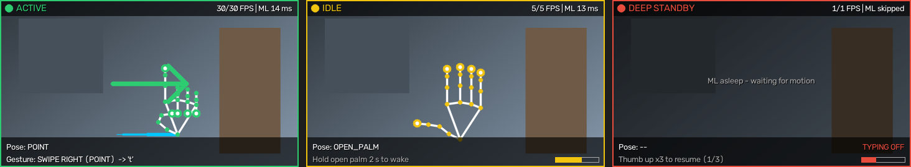
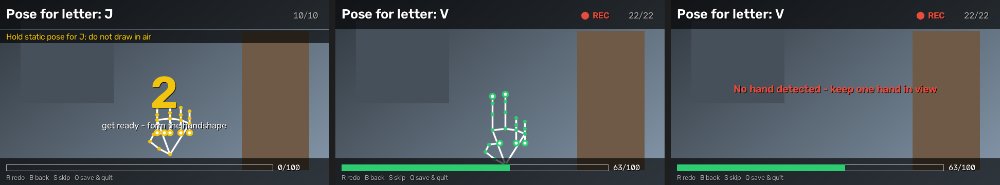

<div align="center">

# ✋ Gesture Virtual Keyboard

**Type with your hands — without touching anything.**
A low-power, headless background service that turns mid-air hand gestures into real OS keystrokes, typing into whatever app has focus.

[](https://www.python.org/)
[](https://opencv.org/)
[](https://ai.google.dev/edge/mediapipe/solutions/vision/hand_landmarker)
[](LICENSE)
[](https://github.com/mohnasi/gesture-virtual-keyboard/actions/workflows/ci.yml)

<!-- Record a 10–15 s screen capture (e.g. ScreenToGif) and save it as docs/demo.gif -->


</div>

---

## Why this exists

Physical keyboards demand two things many people cannot give: **repeated tactile impact** and **fine, isolated finger control**. For people living with severe arthritis, repetitive strain injury (RSI), carpal tunnel syndrome, or recovering from a stroke, every keypress can hurt or simply not be possible. On the other side, technicians in labs, kitchens, workshops or clean rooms often wear soiled or sterile gloves and *shouldn't* touch a shared keyboard at all.

Many of these users still have good **gross arm and hand mobility**: they can raise a hand, hold a shape, and sweep it left or right. Gesture Virtual Keyboard types letters from **static ASL fingerspelling handshapes** that are held, not struck. Editing uses large palm sweeps:

- **Tactile-free.** Large, slow, forgiving motions instead of precise key strikes.
- **Works everywhere.** Keystrokes are injected at the OS level (via `pynput`), so it types into any focused app: browser, IDE, terminal, chat.
- **Invisible until needed.** A coloured tray dot shows the state, and toast notifications appear only for major changes. An optional live telemetry HUD helps you learn the gestures, and one config flag turns it off for pure background mode.
- **Gentle on the battery.** A three-tier power state machine and a pre-ML motion gate mean the neural network barely runs when you aren't using it.

---

## How it works

```
                        ┌──────────────────────────── CaptureWorker thread ───┐
   Webcam ──► cv2.VideoCapture (DSHOW) ──► lock 640×360 ──► mirror ──► LatestFrameSlot
              rate = 30 / 10 / 1 FPS (follows the state machine)    (1-slot mailbox,
                        └───────────────────────────────────────── overwrite-on-write)
                                                                         │
 ┌────────────────────────────── InferenceWorker thread ────────────────▼───────────┐
 │                                                                                  │
 │  IDLE / DEEP STANDBY only:                                                       │
 │  ┌───────────────────────────┐  static   ┌───────────────────────────┐           │
 │  │ Motion gate               │──scene───►│ skip ML, sleep until next │           │
 │  │ gray 160×90 · cv2.absdiff │           │ frame (≈0% NN compute)    │           │
 │  │ + 3 s hold-open latch     │           └───────────────────────────┘           │
 │  └────────────┬──────────────┘                                                   │
 │        motion │ (ACTIVE: every frame)                                            │
 │               ▼                                                                  │
 │  MediaPipe Hands · Lite model (model_complexity=0) → 21 × (x, y, z)              │
 │               ▼                                                                  │
 │  Normalise: pixel space → wrist (node 0) = origin → ÷ ‖node 9 − node 0‖          │
 │               ▼                                                                  │
 │  TemporalBuffer deque(maxlen=45)  ≈ 1.5 s @ 30 FPS                               │
 │               ▼                                                                  │
 │  GestureClassifier ── Pose classifier (FIST, POINT, PEACE, … THUMB_UP/DOWN)      │
 │                    ├─ SwipeDetector       (wrist trajectory, palm-length units)  │
 │                    ├─ StaticHoldDetector  (wake: open palm, steady 2 s)          │
 │                    ├─ RepetitionDetector  ("Off ×3" / "On ×3")                   │
 │                    └─ LetterDetector      (Random Forest → static ASL A–Z,       │
 │                                            0.4 s dwell, 0.2 s release lockout)   │
 │               ▼                                                                  │
 │  ┌─────────────────────────── 3-tier State Machine ───────────────────────────┐  │
 │  │                                                                            │  │
 │  │   ┌──────────┐  open palm held 2 s   ┌──────────┐                          │  │
 │  │   │   IDLE   │ ────────────────────► │  ACTIVE  │──► KeyMapper ──┐         │  │
 │  │   │  10 FPS  │ ◄──────────────────── │  30 FPS  │                │         │  │
 │  │   │  yellow  │    no hand for 2 s    │  green   │                │         │  │
 │  │   └──────────┘                       └────┬─────┘                │         │  │
 │  │        ▲                                  │ "Off, Off, Off"      │         │  │
 │  │        │ "On, On, On"   ┌──────────────┐  │ thumb down ×3        │         │  │
 │  │        └─────────────── │ DEEP STANDBY │◄─┘                      │         │  │
 │  │          thumb up ×3    │  1 FPS · red │                         │         │  │
 │  │                         └──────────────┘                         │         │  │
 │  └──────────────────────────────────────────────────────────────────┼─────────┘  │
 └─────────────────────────────────────────────────────────────────────┼────────────┘
                                                                       ▼
         KeyboardOutput thread ─► pynput.keyboard.Controller ─► focused application
         TrayUI thread (pystray) ◄─ state colour       Toast threads (winotify / plyer)
         Main thread: HudLoop ◄─ HudChannel ◄─ snapshots   (only when ENABLE_HUD = True)
                      └─► OpenCV window: feed + skeleton + state/pose/gesture overlay
```

Each thread is the only owner of the resources it touches: the camera, the MediaPipe graph and the input controller are never shared across threads. See [`docs/ARCHITECTURE.md`](docs/ARCHITECTURE.md) for the full design review covering thread safety, camera release and the edge cases it fixed.

---

## States & power modes

| State | Tray | Capture rate | Motion gate | MediaPipe | Typing | Leaves when… |
|---|---|---|---|---|---|---|
| **ACTIVE** | 🟢 Green | 30 FPS | Off (full inference) | Every frame | ✅ Enabled | No hand for 2 s → IDLE · "Off ×3" → DEEP STANDBY |
| **IDLE** | 🟡 Yellow | 10 FPS | On | Only after motion (+3 s latch) | ❌ | Open palm held steady 2 s → ACTIVE |
| **DEEP STANDBY** | 🔴 Red | 1 FPS | On | Only after motion (+3 s latch) | ⛔ Hard-disabled | "On ×3" → IDLE |

Entering or leaving DEEP STANDBY shows a native desktop notification. The tray menu also has **Activate now**, **Pause typing (Deep Standby)**, **Resume** and **Quit**, for carers or for moments when gestures aren't practical.

---

## Live telemetry HUD



<sub>Left to right: holding a letter (top-3 guesses and dwell bar), a palm swipe typing a space, and the wake hold in IDLE. Rendered by the HUD from the project's synthetic test hands.</sub>

A small window (480×270 by default) opens in the **top-right corner** of the screen and stays on top. It shows:

| Where | What |
|---|---|
| Video | Live webcam feed with the **21-joint MediaPipe hand skeleton** drawn over your hand, plus the recent wrist trajectory (cyan trail). A large arrow flashes when a swipe is recognised |
| ASL panel (ACTIVE) | The classifier's **top-3 letter guesses with confidence %**. A tick on each bar marks the typing threshold, and a **dwell bar** fills over the 0.4 s hold. After a letter is typed the panel shows "relax to repeat" |
| Top bar | **System state** (colour-coded like the tray), measured vs. target FPS, and MediaPipe inference time, or `ML skipped` when the motion gate is sleeping |
| Bottom bar | **Current pose** (`POINT`, `OPEN_PALM`, …), the **last recognised gesture** with the key it typed (e.g. `LETTER H (88%) -> 'h'` or `SWIPE RIGHT (OPEN_PALM) -> SPACE`), the `TYPING OFF` / `NO ASL MODEL` badges, and progress bars for the wake hold and the ×3 sequences |

- **Move it** by dragging anywhere on the video with the mouse. It also reopens in the top-right corner every time.
- **It never steals focus.** On Windows the HUD is a no-activate tool window, so clicking or dragging it never takes keyboard focus away from the app you're typing into. On macOS and Linux, click back into your app after moving the HUD.
- **Close it** with its ✕ to keep running headless. Bring it back from the tray menu with **Show telemetry HUD**.
- **Turn it off completely** with `ENABLE_HUD = False` at the top of [`config.py`](config.py), or `--no-hud` for a single run. The HUD module is then never imported and no OpenCV window is ever created, so the daemon runs in pure low-power background mode.

---

## Gestures

### Control gestures

| Gesture | How to perform it | Works in | Effect |
|---|---|---|---|
| **Wake** | Raise an **open palm** (all fingers + thumb spread) and hold it still for **2 s** | IDLE | → ACTIVE |
| **Off, Off, Off** | Closed fist, **thumb pointing down**, then relax. Repeat **3×** within 6 s | ACTIVE | → DEEP STANDBY (typing disabled) |
| **On, On, On** | Closed fist, **thumb pointing up**, hold ~1 s, then lower. Repeat **3×** within 12 s | DEEP STANDBY | → IDLE |
| **Reposition** | Move your hand | ACTIVE | Moving hands never type. Letters need a still hand |
| **Walk away** | Take your hand out of view for 2 s | ACTIVE | → IDLE (auto-sleep) |

### Typing: static ASL fingerspelling (A–Z)

Form an ASL fingerspelling handshape and **hold it still for 0.4 s**. The letter is typed once.

- **Double letters ("LL"):** relax, or drop your hand, for at least **0.2 s**, then sign the letter again.
- **Changing letters:** going from one letter straight into a different one needs no pause.
- **J and Z:** both are signed with a movement in ASL. In v1 they are treated as **static holds** of their final handshape.
- **No accidental typing:** a hand that is moving never types. The open palm and thumb-down control poses are never read as letters. Letters also pause for 1.5 s after a thumb-down, so the fist you relax into during "Off, Off, Off" isn't typed as A or S.

Letters come from a scikit-learn **Random Forest** trained on MediaPipe hand landmarks (see [Training the ASL model](#training-the-asl-model)). Without a trained model the daemon still runs, and the HUD shows `NO ASL MODEL`.

### Editing: open-palm swipes

Spread your hand open and make one smooth sweep of about 1–2 palm-lengths:

| Open palm swipe | Key |
|---|---|
| → Right | ␣ Space |
| ← Left | ⌫ Backspace |
| ↓ Down | ⏎ Enter |

- Swipe distances are measured in palm-lengths, so the same motion works at 40 cm or 1.5 m from the camera.
- Bringing your hand back after a swipe is recognised as a return stroke and is not typed.
- The mapping is `EDIT_SWIPES` in [`config.py`](config.py).

---

## Training the ASL model

The model isn't shipped in the repo. You build it from your own hand, from public datasets, or from both. Every route uses the same MediaPipe tracker and the same `features.py` as the live app, so training and runtime features always match.

### Quick start: calibrate on your own hand (recommended)

```powershell
python tools\record_samples.py          # ~5 minutes, letters A-Z
python tools\train_asl.py data\features\user_samples.npz
python main.py
```



For each letter the recorder works like this:

1. It shows **"Pose for letter: X"** and counts down **3 s**.
2. It records **100 frames** of the held handshape, keeping every second valid frame for natural variety. A skeleton overlay and a progress bar are shown throughout.
3. Frames with no hand are skipped, with a red **"No hand detected"** alert.
4. For **J** and **Z** it reminds you to *hold the static pose, not draw in the air*.

Either hand works, because left hands are mirrored to right hands by the same `features.asl_features` used at runtime.

- **Keys:** **R** redo the letter, **B** back one letter, **S** skip it, **Q / Esc** save and quit. A letter interrupted part-way is discarded.
- **Fix weak letters later:** `python tools\record_samples.py --letters MNST --append` re-records just those letters. The rest of the file is kept.
- **Record and train in one go:** add `--train`.

`train_asl.py` validates personal data by holding out whole **time blocks** of each letter's recording, so near-identical neighbouring frames never land on both sides of a split. Treat that score as an estimate for *you*, not for other people. The confidence threshold never drops below `--min-threshold` (0.5), so relaxed or in-between hand shapes aren't typed just because your recordings were very clean.

### Adding public datasets (optional)

**1. Download data** (needs a free Kaggle account: kaggle.com → Settings → API → *Create New Token*, then save `kaggle.json` to `%USERPROFILE%\.kaggle\`):

```powershell
pip install kaggle
kaggle datasets download -d grassknoted/asl-alphabet -p data\raw\asl-alphabet --unzip
kaggle datasets download -d mrgeislinger/asl-rgb-depth-fingerspelling-spelling-it-out -p data\raw\spelling-it-out --unzip
```

| Dataset | Content | Why |
|---|---|---|
| [ASL Alphabet](https://www.kaggle.com/datasets/grassknoted/asl-alphabet) | 87,000 images (200×200), A–Z (+ space/del/nothing, which are skipped), GPL-2 | Covers all 26 letters, but the images are near-identical, so its scores are optimistic |
| [Spelling It Out](https://empslocal.ex.ac.uk/people/staff/np331/index.php?section=FingerSpellingDataset) (Pugeault & Bowden 2011) | 5 signers, 24 static letters (no J/Z) | Lets you validate on **people the model has never seen**. Cite the paper |

**2. Extract landmarks.** This writes `data/features/*.npz`. The script reports the detection rate per letter, and `data/` is git-ignored.

```powershell
python tools\extract_landmarks.py data\raw\asl-alphabet --out data\features\asl_alphabet.npz --group asl_alphabet --max-per-class 800
python tools\extract_landmarks.py data\raw\spelling-it-out --out data\features\spelling_it_out.npz --signer-level 1 --include "color_"
```

Labels come from the image's folder name (single letters only). Look at the unzipped layout first: `--signer-level K` tells the script which folder below the root names the signer.

**3. Train.** This writes `models/asl_rf.pkl` and a report, `models/asl_rf.txt`:

```powershell
python tools\train_asl.py data\features\asl_alphabet.npz data\features\spelling_it_out.npz
```

- **Validation:** cross-validates with `GroupKFold` **by signer**. With a single signer it falls back to a stratified split and prints a warning that the score is optimistic.
- **Threshold:** it calibrates the confidence threshold at which out-of-fold predictions are ≥ 95% correct, and saves it in the model.
- **Report:** lists the most common confusions. Expect E/M/N/S/T and U/V/R.
- **Held-out test:** `--test other.npz` scores the final model on a dataset it never trained on.

**4. Run** `python main.py`. The model is loaded from `models/asl_rf.pkl` (or `--asl-model PATH`).

> **Notes**
> - A pickled model only reliably loads in the scikit-learn version that saved it. Pin that version in `requirements.txt` once you're happy with a model.
> - Only load model files you trained yourself: unpickling can run arbitrary code.
> - Fingerspelling depends on fine finger and thumb placement, which is hard for some of the users this project targets. The single biggest accuracy gain is training on the user's own hand.

---

## Installation

> **Requirements:** Python 3.10+ and a webcam. Developed for **Windows 10/11**; macOS and Linux (X11) are supported with the notes below.
> Python **3.10–3.12** is recommended: it gets MediaPipe's legacy Lite hand model (`model_complexity=0`), which has the lowest power draw. On 3.13+ the app switches to the MediaPipe Tasks `HandLandmarker` automatically and downloads its model once (~8 MB) into `models/`.

### Windows (PowerShell)

```powershell
git clone https://github.com/mohnasi/gesture-virtual-keyboard.git
cd gesture-virtual-keyboard

py -3.12 -m venv .venv
.\.venv\Scripts\Activate.ps1
python -m pip install --upgrade pip
pip install -r requirements.txt

python main.py            # with a console window (shows logs)
pythonw main.py           # fully headless background service
```

To **start with Windows**, press `Win + R`, type `shell:startup`, and create a shortcut there with the target
`C:\path\to\gesture-virtual-keyboard\.venv\Scripts\pythonw.exe C:\path\to\gesture-virtual-keyboard\main.py`.

### macOS / Linux

```bash
git clone https://github.com/mohnasi/gesture-virtual-keyboard.git
cd gesture-virtual-keyboard
python3.12 -m venv .venv
source .venv/bin/activate
pip install -r requirements.txt
python main.py
```

- **macOS:** grant your terminal (or Python) **Camera** and **Accessibility** permissions in System Settings → Privacy & Security. Accessibility is what lets it send keystrokes.
- **Linux:** `pynput` needs an **X11** session. Under Wayland, global key injection is restricted by design. The tray icon needs a desktop with AppIndicator / StatusNotifier support.

### Command-line options

| Flag | Default | Purpose |
|---|---|---|
| `--camera N` | `0` | Webcam index |
| `--camera-backend` | `auto` | `auto` (DirectShow on Windows), `dshow`, `msmf`, `v4l2`, `avfoundation`, `any` |
| `--tracker` | `auto` | `solutions` (Lite model), `tasks`, or `auto` fallback |
| `--start-active` | off | Start in ACTIVE instead of IDLE |
| `--no-mirror` | off | Disable the selfie-view mirror |
| `--hud` / `--no-hud` | `ENABLE_HUD` | Show or hide the live telemetry window for this run |
| `--asl-model PATH` | `models/asl_rf.pkl` | Trained ASL letter model to load |
| `--no-tray` / `--no-toasts` | off | Run without the tray icon / notifications |
| `--log-level` | `INFO` | `DEBUG` logs every recognised gesture |

Logs rotate in `logs/gvk.log`. This matters most under `pythonw`, where there's no console to print to.

---

## Project structure

```
gesture-virtual-keyboard/
├── main.py              # entry point: wiring, signals, ordered shutdown
├── config.py            # every threshold, FPS budget, ASL dwell and edit swipes
├── camera.py            # CaptureWorker (sole camera owner) + LatestFrameSlot
├── motion_gate.py       # cv2.absdiff motion gate with hold-open latch
├── tracker.py           # MediaPipe backends + landmark normalisation
├── gestures.py          # pose classifier, TemporalBuffer, detectors incl. LetterDetector
├── features.py          # ASL feature vector (shared by training and runtime)
├── asl_classifier.py    # loads/validates the Random Forest bundle
├── state_machine.py     # ACTIVE / IDLE / DEEP_STANDBY transitions
├── keyboard_output.py   # KeyMapper + pynput injection worker
├── ui.py                # pystray tray icon + toast notifications
├── hud.py               # live telemetry HUD (renderer + draggable window)
├── pipeline.py          # InferenceWorker: gate → track → classify → act
├── tools/
│   ├── record_samples.py     # personal webcam calibration A-Z -> user_samples.npz
│   ├── extract_landmarks.py  # dataset images -> landmark features (.npz)
│   └── train_asl.py          # signer-grouped CV, threshold calibration, .pkl
├── tests/               # 129 hardware-free tests (synthetic hands, fake camera/GUI)
└── docs/ARCHITECTURE.md # design review & threading model
```

## Testing

The test suite needs **no webcam, no MediaPipe and no keyboard backend**. It drives the real logic with synthetic 21-point hands, scripted trajectories and a fake `VideoCapture`, and also runs the full daemon lifecycle with real threads.

```bash
pip install -r requirements-dev.txt
pytest          # 129 tests
ruff check .
```

CI runs both on Python 3.10, 3.11, 3.12 and 3.13.

## License

[MIT](LICENSE). Free to use, adapt and build on, especially for accessibility work.
